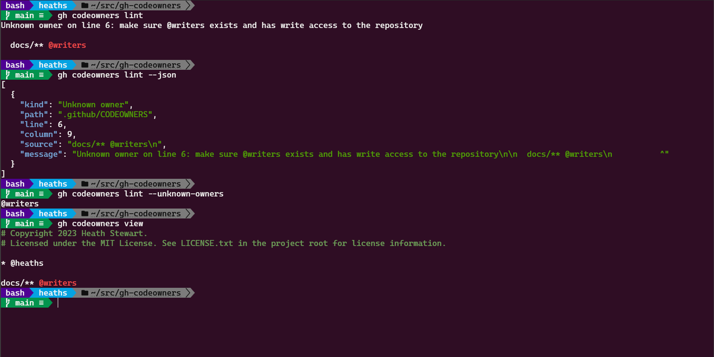

# CODEOWNERS GitHub CLI extension

[](https://github.com/heaths/gh-codeowners/releases/latest)
[](https://github.com/heaths/gh-codeowners/actions/workflows/ci.yml)

Lint your CODEOWNERS file.

## Install

Make sure you have version 2.0 or [newer] of the [GitHub CLI] installed.

```bash
gh extension install heaths/gh-codeowners
```

### Upgrade

The `gh extension list` command shows if updates are available for extensions. To upgrade, you can use the `gh extension upgrade` command:

```bash
gh extension upgrade heaths/gh-codeowners

# Or upgrade all extensions:
gh extension upgrade --all
```

When used in Continuous Integration, starting with `gh` version [2.25.0](https://github.com/cli/cli/releases/tag/v2.25.0), you can install or upgrade the extension with a single command:

```bash
gh extension install --force heaths/gh-codeowners
```

## Usage

Render a list of errors based on the current branch's CODEOWNERS errors reported by GitHub:

```bash
gh codeowners lint
```

You can also get a sorted list of unknown owners or just return the raw JSON:

```bash
gh codeowners lint --json
gh codeowners lint --unknown-owners
```

To render your CODEOWNERS file with errors reported by GitHub:

```bash
gh codeowners view
```



## Configuration

This extension will render colors whenever possible and, in some scenarios like when printing a list of errors,
maybe change the format to prefer colors over markers that may work better only for non-colored text.

You can override these colors on the command line (pass `--help` for details) or permanently with a configuration file
located under your home directory on all platforms: _~/.config/gh-codeowners/config.yml_

```yaml
color:
  comment: "#6A9955"
  error:   "#F44747"
```

[GitHub CLI]: https://github.com/cli/cli
[newer]: https://github.com/cli/cli/releases/latest


## License

Licensed under the [MIT](LICENSE.txt) license.
